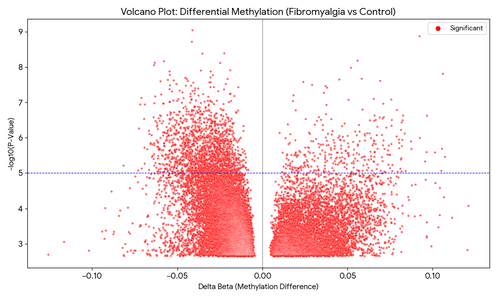
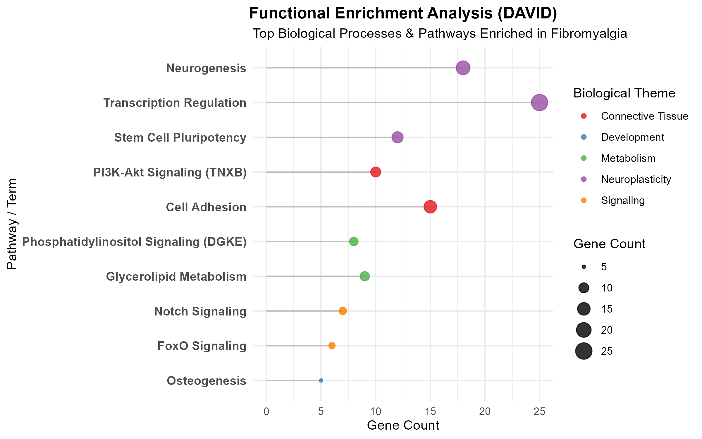

# Epigenetic Signatures of Fibromyalgia: A ChAMP Methylation Pipeline Analysis

## Project Overview
Fibromyalgia is a chronic pain condition characterized by widespread musculoskeletal pain, fatigue, and cognitive difficulties. Despite its prevalence, the molecular mechanisms driving the disease remain poorly understood.

This project analyzes **genome-wide DNA methylation patterns** (Illumina 450k array) in Fibromyalgia patients vs. healthy controls to identify epigenetic biomarkers. Using the **ChAMP pipeline** in R, I identified significant differential methylation in genes linked to **connective tissue integrity** and **neural plasticity**, providing molecular insights into the pathology of central sensitization.

## Key Biological Findings

### 1. Connective Tissue Pathology (TNXB)
I identified significant differential methylation in the **Tenascin XB (TNXB)** gene.
* **Significance:** Mutations in `TNXB` are the known cause of **Ehlers-Danlos Syndrome (EDS)**.
* **Insight:** Given the high clinical comorbidity between Fibromyalgia and Hypermobility, epigenetic silencing of `TNXB` suggests a novel mechanism where acquired connective tissue defects contribute to the chronic pain phenotype.

### 2. Maladaptive Neuroplasticity (PCDH Cluster)
Gene Set Enrichment Analysis (GSEA) revealed a massive clustering of methylation changes in the **Protocadherin Alpha (PCDHA)** gene cluster on Chromosome 5q31.
* **Significance:** Protocadherins are critical for neural circuit formation and synaptic specificity.
* **Insight:** Combined with the enrichment of neurodevelopmental transcription factors (**SOX2**, **PAX6**), this points to "maladaptive plasticity"—suggesting that pain processing pathways in these patients may be actively "rewiring" or reverting to a hypersensitive state.

### 3. Metabolic Hyperexcitability (DGKE)
Alterations were found in **DGKE** (Diacylglycerol Kinase Epsilon), a regulator of lipid signaling.
* **Significance:** `DGKE` controls the **Phosphatidylinositol signaling system**, which regulates intracellular calcium.
* **Insight:** Disruption of this pathway can lower the activation threshold of sensory neurons, contributing to the "Central Sensitization" hallmark of Fibromyalgia.

### 4. Functional Enrichment Analysis
To validate the biological relevance of the methylation changes, I performed Gene Ontology (GO) and KEGG pathway analysis using DAVID.

---

## Visualizations

### 1. Volcano Plot: Global Methylation Changes
This plot visualizes the 18,611 differentially methylated probes (DMPs).

*(Note: Red dots indicate significant probes with Adj. P-Value < 0.05)*

### 2. Manhattan Plot: Genome-Wide Distribution
Shows the distribution of significant methylation signals across all chromosomes.


### 3. TNXB Methylation Levels
Detailed view of the specific probe located in the `TNXB` gene, showing distinct methylation differences between Fibromyalgia and Control groups.


### 4.**Top Enriched Pathways:**
The analysis confirmed a convergence on **neural development** and **connective tissue** maintenance.



---

## Methods & Workflow

### Tools Used
* **R Version:** 4.0+
* **Bioinformatics Packages:** `ChAMP`, `minfi`, `limma`, `DMRcate`
* **Databases:** Gene Ontology (GO), KEGG, STRING-db

### Analysis Pipeline
1.  **Data Loading:** Parsed IDAT files using `minfi` and `ChAMP`.
2.  **Quality Control (QC):**
    * Filtered probes with detection p-value > 0.01.
    * Removed SNP-related probes and sex-chromosome probes to avoid bias.
3.  **Normalization:** Applied **BMIQ** (Beta Mixture Quantile Normalization) to correct for Type-I and Type-II probe bias.
4.  **DMP Analysis:** Identified Differentially Methylated Probes using linear regression models (`limma`).
5.  **DMR Analysis:** Identified Differentially Methylated Regions (clusters of probes) using the **Bumphunter** algorithm.
6.  **Functional Enrichment:** Performed GSEA and GO analysis to interpret biological significance.

---

## Repository Structure
```text
Fibromyalgia_Methylation/
│
├── README.md               # Project overview and findings
├── scripts/
│   ├── 01_ChAMP_Pipeline.R # Full R code for QC, Normalization, and DMP/DMR calling
│   └── 02_Plotting.R       # Code for generating Volcano, Manhattan, and Box plots
├── results/
│   ├── volcano_plot.png    # Visual output
│   ├── manhattan_plot.png  # Visual output
│   ├── TNXB_Boxplot.png    # Visual output
│   ├── DMP_Results.csv     # List of significant single probes
│   └── DMR_Results.csv     # List of significant regions
└── data/
    └── SampleSheet.csv     # Metadata for the samples
